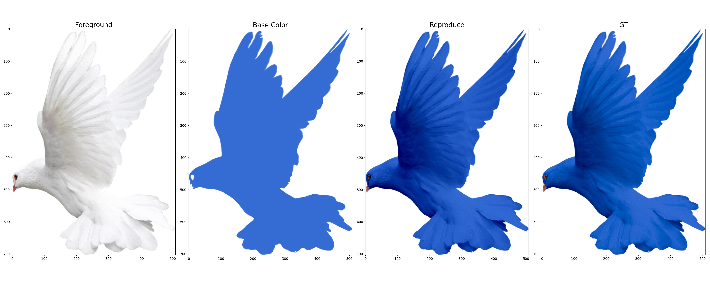

## Photoshop Features

### Linear Burn in Blend Mode

Let foreground image be $f$, color mask be $c$ and blended result be $y$.
Then, the $y$ can be fomulated as

$$
y = f + c - 1.
$$

<figure>

<figcaption align = "center"><b></b></figcaption>
</figure>

Check the example code in [that directory](linear_burn)

### References
- [Linear Burn YouTube](https://www.youtube.com/watch?v=cnsC8ycR9O8) 
